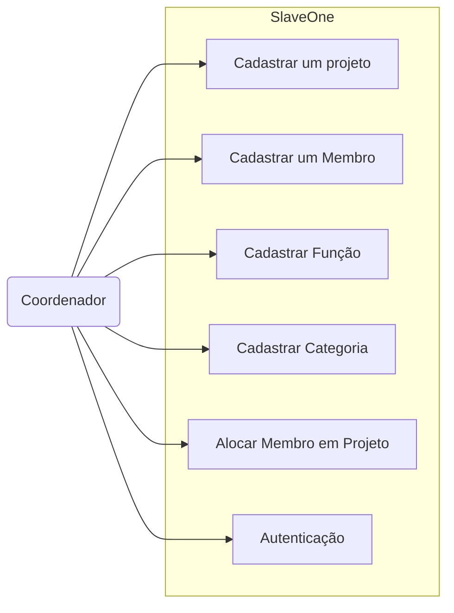

```mermaid
flowchart LR
    actor("Coordenador")
    subgraph SlaveOne
        UC1["Cadastrar um projeto"]
        UC2["Cadastrar um Membro"]
        UC3["Cadastrar Função"]
        UC4["Cadastrar Categoria"]
        UC5["Alocar Membro em Projeto"]
        UC6["Autenticação"]
    end

    actor --> UC1
    actor --> UC2
    actor --> UC3
    actor --> UC4
    actor --> UC5
    actor --> UC6
```