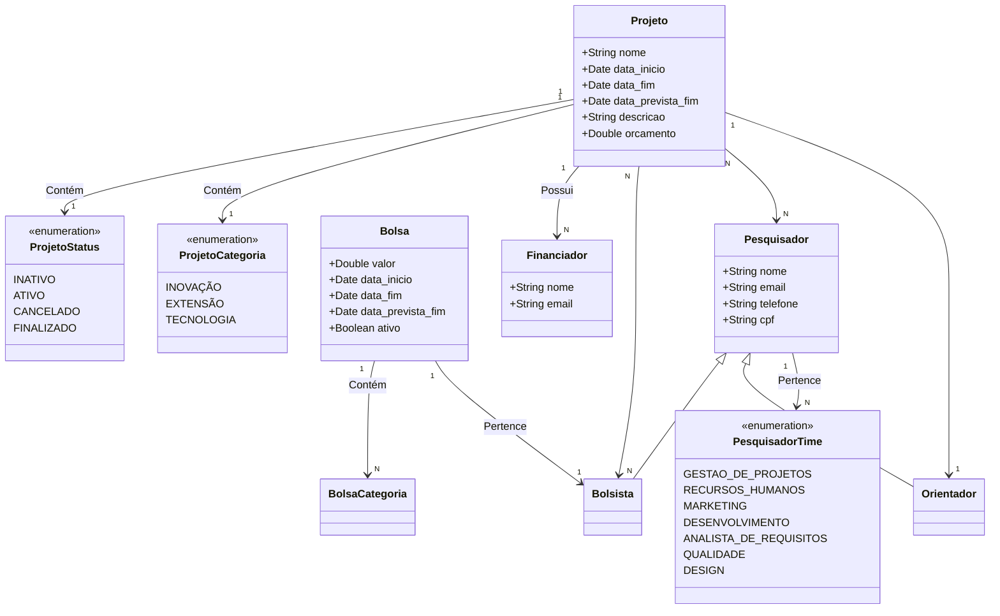

## Dicionário 🔴🔴🔴🔴🔴🔴🔴🔴🔴 FINALIZAR

### Classes:
- **Projeto:** Representa um projeto de um laboratório.
- **Financiador:** Representa o patrocinador do projeto.
- **Pesquisador:** Representa o pesquisador envolvido no projeto, com detalhes como nome, e-mail, etc.
- **Orientador e Bolsista:** Subclasses de Pesquisador, indicando funções específicas.
- **Bolsa:** Representa bolsas dadas aos pesquisadores.

## Relacionamentos:
- Um projeto tem uma associação com um ou mais Financiadores, Pesquisadores e Bolsistas.
- Bolsa é vinculada ao Bolsista e inclui o valor da bolsa e as datas.
- Projeto tem uma associação com as enums ProjetoCategoria e ProjetoStatus.